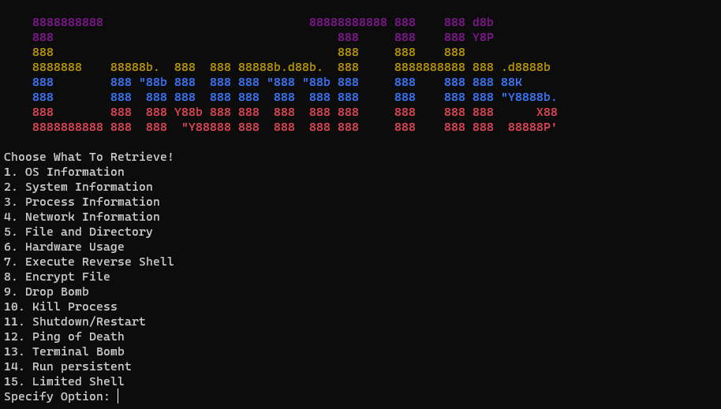

# EnumTHis
Post Exploitation Remote Enumeration tool.   
Built to fulfill the requirement of MASP module of Asia Pacific University 

# Installation
## Client-side
- Install `pwntools` and `scapy`
Use the command `pip3 install scapy pwn` to install both libraries.
## Server-side/victim (If needed)
- Install `cryptography` and `psutil`
Use the command `pip3 install psutil cryptography` to install both libraries.

# Usage
- Run the server program (`onefile.py` or `main.py` if the whole main directory is available)
- Use our `client.py` program inside the `./client` directory
- Choose options! 

# Happy Hacking!
